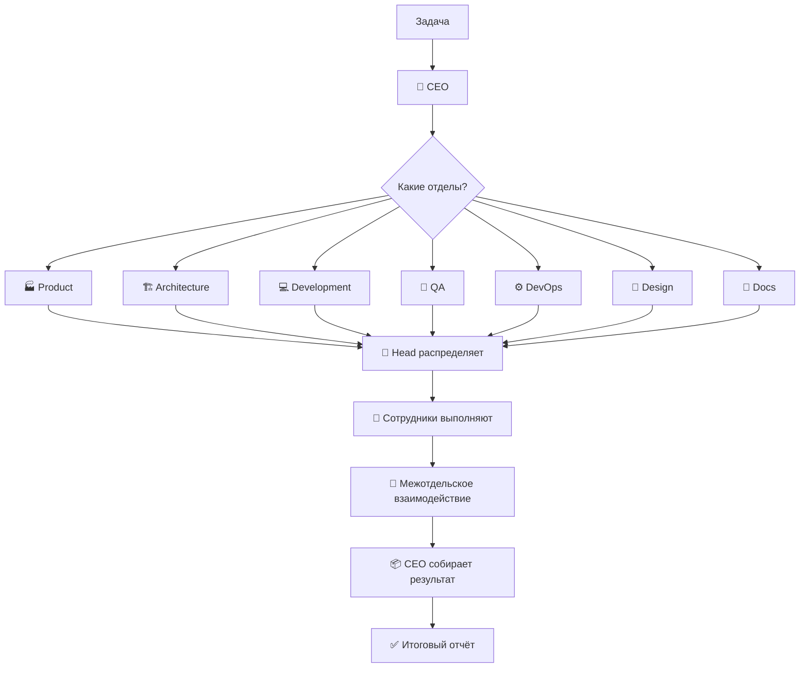

# 🏢 AI Agents Team — Корпорация AI-разработчиков

**Корпорация виртуальных AI-агентов** с полноценной организационной структурой.  
Каждое направление — отдельный отдел со своим менеджером и сотрудниками.

## Концепция

При получении задачи корпорация действует как реальная IT-компания:

1. **🧠 CEO (Главный Оркестратор)** — анализирует задачу глобально
2. **🏭 Определяет какие отделы задействовать** — Product, Architecture, Development, QA, DevOps, Design, Docs
3. **👔 Назначает руководителей отделов (Heads)** — каждый получает свою подзадачу
4. **👥 Руководители распределяют работу внутри отдела** — сотрудники выполняют
5. **🔄 Cross-department coordination** — отделы взаимодействуют между собой
6. **📦 CEO собирает результат** — формирует итоговый отчёт

## Организационная структура

```
┌──────────────────────────────────────────────────────────────────┐
│              🧠 CEO — Главный Оркестратор                        │
│     Анализ → Планирование → Назначение отделов → Контроль       │
└──────────────────────────────────────────────────────────────────┘
                                    │
       ┌────────────┬───────────────┼──────────────┬──────────────┐
       ▼            ▼               ▼              ▼              ▼
┌────────────┐ ┌────────────┐ ┌────────────┐ ┌────────────┐ ┌────────────┐
│ 🏭 PRODUCT │ │ 🏗️ ARCH   │ │ 💻 DEV     │ │ 🧪 QA     │ │ ⚙️ DEVOPS  │
│            │ │            │ │            │ │            │ │            │
│ PM         │ │ System     │ │ Tech Lead  │ │ QA Lead    │ │ DevOps     │
│ Analyst    │ │ Architect  │ │ Frontend   │ │ Manual     │ │ Lead       │
│            │ │ Solution   │ │ Backend    │ │ Auto       │ │ SRE        │
│            │ │ Architect  │ │ Fullstack  │ │ Tester     │ │ Engineer   │
└────────────┘ └────────────┘ └────────────┘ └────────────┘ └────────────┘
                                    │
                    ┌───────────────┴──────────────┐
                    ▼                              ▼
            ┌────────────┐                  ┌────────────┐
            │ 🎨 DESIGN  │                  │ 📖 DOCS    │
            │            │                  │            │
            │ Design     │                  │ Tech       │
            │ Lead       │                  │ Writer     │
            │ UI/UX      │                  │            │
            └────────────┘                  └────────────┘
```

## Отделы

| Отдел | Руководитель | Сотрудники |
|-------|-------------|------------|
| 🏭 **Product** | Product Manager | Business Analyst |
| 🏗️ **Architecture** | System Architect | Solution Architect |
| 💻 **Development** | Tech Lead | Frontend, Backend, Fullstack Developer |
| 🧪 **QA** | QA Lead | Manual Tester, Automation Tester |
| ⚙️ **DevOps** | DevOps Lead | SRE / Infrastructure Engineer |
| 🎨 **Design** | Design Lead | UI/UX Designer |
| 📖 **Docs** | Technical Writer | — |

## Как это работает



## Быстрый старт

```bash
# Установка
git clone https://github.com/dlydedica/ai_agents_team.git

# Запуск задачи
python team.py run "Создать микросервис для сокращения ссылок"

# Список отделов и сотрудников
python team.py list-departments

# Информация об отделе
python team.py department product
```

## Структура репозитория

```
ai_agents_team/
├── orchestration/       # 🧠 CEO и совет отделов
│   ├── ceo.md
│   └── council.md
├── departments/         # 🏢 Отделы
│   ├── product/         # 🏭 Отдел продукта
│   ├── architecture/    # 🏗️ Отдел архитектуры
│   ├── development/     # 💻 Отдел разработки
│   ├── qa/              # 🧪 Отдел тестирования
│   ├── devops/          # ⚙️ Отдел DevOps
│   ├── design/          # 🎨 Отдел дизайна
│   └── docs/            # 📖 Отдел документации
├── workflows/           # Процессы взаимодействия
├── docs/                # Документация
├── examples/            # Примеры
├── team.py              # Точка входа
└── README.md
```