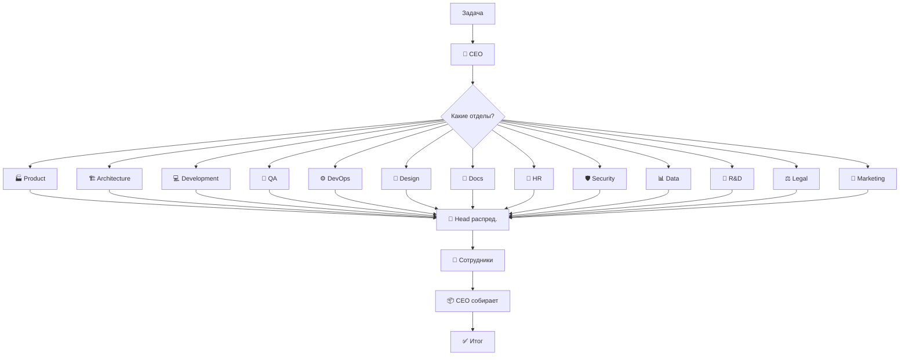

# 🏢 AI Agents Team — Корпорация AI-разработчиков

**Корпорация виртуальных AI-агентов** с полноценной организационной структурой.  
Каждое направление — отдельный отдел со своим менеджером и сотрудниками.

## Концепция

При получении задачи корпорация действует как реальная IT-компания:

1. **🧠 CEO (Главный Оркестратор)** — анализирует задачу глобально
2. **🏭 Определяет какие отделы задействовать** — Product, Architecture, Development, QA, DevOps, Design, Docs, HR, Security, Data, R&D, Legal, Marketing
3. **👔 Назначает руководителей отделов (Heads)** — каждый получает свою подзадачу
4. **👥 Руководители распределяют работу внутри отдела** — сотрудники выполняют
5. **🔄 Cross-department coordination** — отделы взаимодействуют между собой
6. **📦 CEO собирает результат** — формирует итоговый отчёт

## Организационная структура

```
┌──────────────────────────────────────────────────────────────────┐
│              🧠 CEO — Главный Оркестратор                        │
│     Анализ → Планирование → Назначение отделов → Контроль       │
└──────────────────────────────────────────────────────────────────┘
                                    │
       ┌────────────┬───────────────┼──────────────┬──────────────┐
       ▼            ▼               ▼              ▼              ▼
┌────────────┐ ┌────────────┐ ┌────────────┐ ┌────────────┐ ┌────────────┐
│ 🏭 PRODUCT │ │ 🏗️ ARCH   │ │ 💻 DEV     │ │ 🧪 QA     │ │ ⚙️ DEVOPS  │
│            │ │            │ │            │ │            │ │            │
│ PM         │ │ System     │ │ Tech Lead  │ │ QA Lead    │ │ DevOps     │
│ Analyst    │ │ Architect  │ │ Frontend   │ │ Manual     │ │ Lead       │
│            │ │ Solution   │ │ Backend    │ │ Auto       │ │ SRE        │
│            │ │ Architect  │ │ Fullstack  │ │ Tester     │ │ Engineer   │
└────────────┘ └────────────┘ └────────────┘ └────────────┘ └────────────┘
                                    │
                    ┌───────────────┴──────────────┐
                    ▼                              ▼
            ┌────────────┐                  ┌────────────┐
            │ 🎨 DESIGN  │                  │ 📖 DOCS    │
            │            │                  │            │
            │ Design     │                  │ Tech       │
            │ Lead       │                  │ Writer     │
            │ UI/UX      │                  │            │
            └────────────┘                  └────────────┘
                                    │
                                    ▼
                            ┌────────────┐
                            │ 👥 HR      │          ┌────────────┐          ┌────────────┐
                            │            │          │ 🛡️ SEC    │          │ 📊 DATA    │
                            │ HR Lead    │          │            │          │            │
                            │ HR Analyst │          │ Security   │          │ Data Lead  │
                            │ L&D Spec   │          │ Engineer   │          │ Data Eng   │
                            └────────────┘          │ Compliance │          │ Data Sci   │
                                                     └────────────┘          │ BI Analyst │
                                                                             └────────────┘
                            ┌────────────┐          ┌────────────┐
                            │ 🔬 R&D    │          │ ⚖️ LEGAL  │
                            │            │          │            │
                            │ R&D Lead   │          │ Legal Lead │
                            │ Research   │          │ IP & Lic   │
                            │ Engineer   │          │ Contracts  │
                            └────────────┘          └────────────┘
```

## Отделы

| Отдел | Руководитель | Сотрудники |
|-------|-------------|------------|
| 🏭 **Product** | Product Manager | Business Analyst |
| 🏗️ **Architecture** | System Architect | Solution Architect |
| 💻 **Development** | Tech Lead | Frontend, Backend, Fullstack Developer |
| 🧪 **QA** | QA Lead | Manual Tester, Automation Tester |
| ⚙️ **DevOps** | DevOps Lead | SRE / Infrastructure Engineer |
| 🎨 **Design** | Design Lead | UI/UX Designer |
| 📖 **Docs** | Technical Writer | — |
| 👥 **HR** | HR Lead | HR Analyst, L&D Specialist, Talent Scout |
| 🛡️ **Security** | Security Lead | Security Engineer, Compliance Officer |
| 📊 **Data** | Data Lead | Data Engineer, Data Scientist, BI Analyst |
| 🔬 **R&D** | R&D Lead | Research Engineer, Innovation Analyst |
| ⚖️ **Legal** | Legal Lead | IP & License Specialist, Contracts Manager |
| 📣 **Marketing** | Marketing Lead | Content Marketing Manager, Growth Marketing Manager, Brand Designer, Marketing Analyst |

## Как это работает



## Быстрый старт

### Локально (в этом репозитории)

```bash
# Список отделов
python team.py list-departments

# Информация об отделе
python team.py department development

# Запуск задачи (заглушка)
python team.py run "Создать микросервис для сокращения ссылок"

# Запуск задачи из файла
python team.py run --file examples/task_example.json
```

### В Copilot Chat

Просто откройте Copilot Chat и выберите агента **🧠 CEO — Оркестратор AI-команды** из выпадающего списка. Затем опишите задачу — Оркестратор сам проанализирует и распределит работу.

### Интеграция в другой проект

```bash
# 1. Добавьте ai_agents_team в ваш проект
cd /путь/к/вашему/проекту
git submodule add https://github.com/dlydedica/ai_agents_team.git ai_agents_team

# 2. Запустите скрипт интеграции
python ai_agents_team/integration/integrate.py .

# 3. Откройте проект в VS Code
# 4. В Copilot Chat выберите "🧠 CEO — Оркестратор AI-команды"
# 5. Опишите задачу
```

## Структура репозитория

```
ai_agents_team/
├── orchestration/       # 🧠 CEO и совет отделов
│   ├── ceo.md
│   └── council.md
├── departments/         # 🏢 Отделы
│   ├── product/         # 🏭 Отдел продукта
│   ├── architecture/    # 🏗️ Отдел архитектуры
│   ├── development/     # 💻 Отдел разработки
│   ├── qa/              # 🧪 Отдел тестирования
│   ├── devops/          # ⚙️ Отдел DevOps
│   ├── design/          # 🎨 Отдел дизайна
│   ├── docs/            # 📖 Отдел документации
│   ├── hr/              # 👥 Отдел HR и развития команды
│   ├── security/        # 🛡️ Отдел информационной безопасности
│   ├── data/            # 📊 Отдел данных и аналитики
│   ├── rd/              # 🔬 Отдел исследований и инноваций
│   ├── legal/           # ⚖️ Отдел юридического compliance
│   └── marketing/       # 📣 Отдел маркетинга и продвижения
├── workflows/           # Процессы взаимодействия
├── integration/         # 🔗 Интеграция в другие проекты
│   ├── orchestrator.agent.md  # Агент для VS Code Copilot
│   ├── integrate.py           # Скрипт автоматической интеграции
│   └── README.md              # Инструкция по интеграции
├── docs/                # Документация
├── examples/            # Примеры
├── team.py              # Точка входа CLI
└── README.md
```